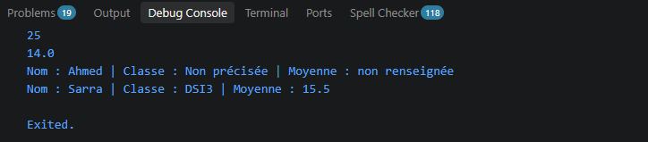
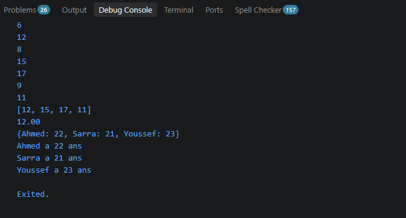

## Palier 1 Captures et Question Comprehension :

//final est fixee une seule fois , const est constante conne a l'avance

## Palier 2 :

//null par defaut interdit en dart pour eviter les errors en programme

## Palier 3 :

//flutter utilise des parametres nommes plutot que positionnels car positionnel est plus simple et facile

## Palier 4 :

//liste a des elements dans un ordre , et map des elements avec cle
