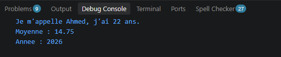
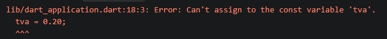
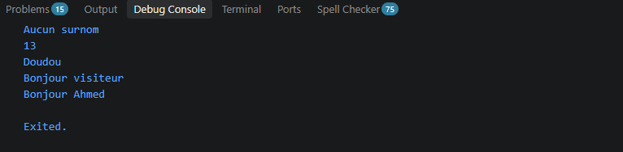

## Palier 1 Captures et Question Comprehension :

//final est fixee une seule fois , const est constante conne a l'avance

## Palier 2 :

//null par defaut interdit en dart pour eviter les errors en programme
